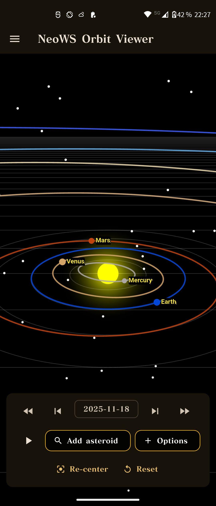
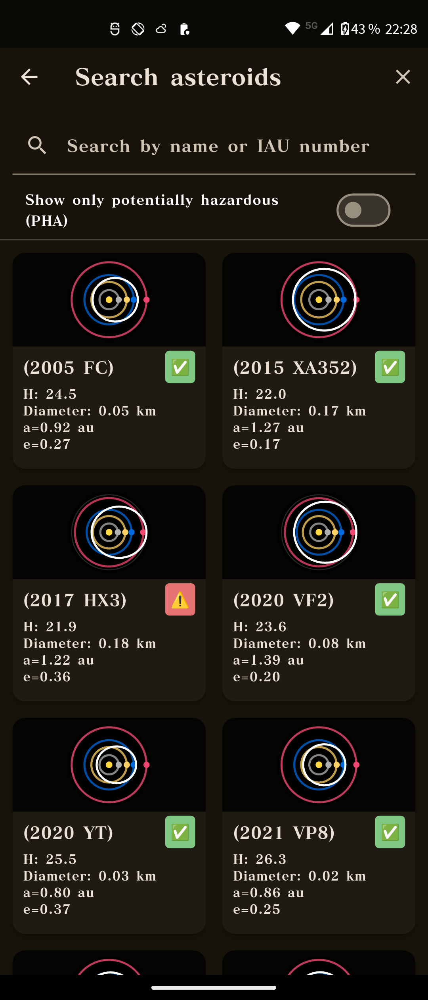
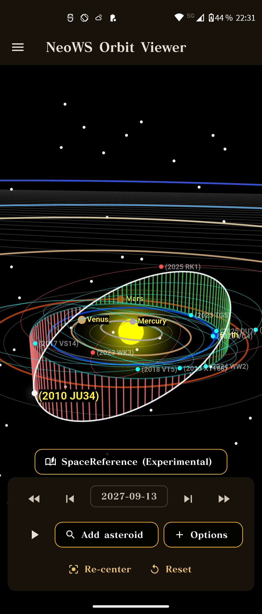
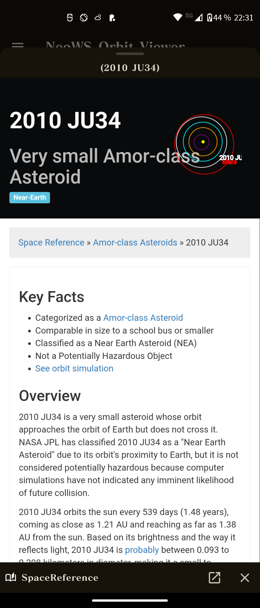
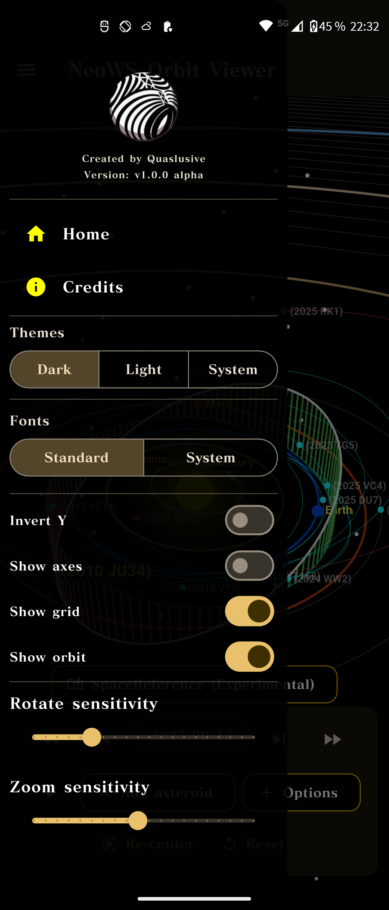

## Implementation and Feature Overview

### 3D Orbit Viewer

### Overview

This project is an Android app where the user can:

- View a 3D visualization of the solar system  
- Add asteroids to the scene via several options:
  - Random NEO
  - Today’s NEOs
  - Hazardous NEOs
  - All NEOs in the selected range
- Search for asteroids by name or ID  
- Open detailed external information via **SpaceReference.org** (when a matching page exists)  
- Visualize orbits in both 2D and 3D  
- Adjust theme and various settings  

When the app starts, only the solar system is shown (sun + planets). No asteroids are added automatically. The user must actively add asteroids via the search view or the **Options** menu.

---

### Start / Home Screen – Solar System View

The start screen is a 3D view of the solar system. It shows:

- The sun in the center  
- Planet orbits  
- Any asteroids that the user has added to the scene  

No asteroids are loaded automatically at startup. The user decides when to populate the scene with objects.

From this view the user can:

- Open the **Options** menu to add asteroids to the scene  
  - For example: today’s objects, random objects, or all known / hazardous asteroids  
- Tap an existing asteroid to open its detail view  

At the bottom of the 3D view there is a **time-lapse control** where the user can:

- Play and pause time  
- Fast-forward to see how the asteroids move along their orbits  

To help navigation in the 3D scene there are also:

- A **Re-center** button that moves the camera back to focus on the sun  
- A **Reset** button that restores the camera position and view to the default  

Via the side menu (`SideMenu`) the user can adjust various settings:

- Toggle between light and dark theme  
- Choose font (custom “standard” font or system font)  
- Toggle invert Y-axis for camera controls  
- Toggle display of coordinate axes and grid  
- Toggle display of orbit lines (can improve performance if turned off)  
- Adjust sensitivity for rotation and zoom in the 3D view  

The side menu also contains a **Credits** page, listing which APIs and services are used, including:

- **NASA – NeoWs API**  
- **SpaceReference.org**

---

### Search Function

On the search page (`asteroid_search_page.dart`) the user can:

- Enter a name or designation (e.g. `Apophis`)  
- Enter an SPK-ID (NeoWs ID)  
- Enable a filter for **Potentially Hazardous Asteroids (PHA)**  

Search flow:

1. The user enters a name or ID and/or enables the PHA filter.  
2. `NeoWsService` fetches or filters the matching asteroids.  
3. The result is shown as a list of cards (`AsteroidCard`), consistent with other views in the app.

If no asteroids are found, a clear message is shown instead of an empty screen.

---

### 3D Orbit Viewer

A central part of the app is the 3D visualization (`orbit_viewer_3d_page.dart` and `orbit_3d_canvas.dart`). In this view:

- The sun is drawn in the center  
- Earth’s orbit is displayed  
- Selected asteroid orbits are rendered  
- Camera position and focus can be changed  

The camera is represented by a spherical position (distance, pitch, yaw) that is converted to Cartesian coordinates using a helper similar to `_sphericalToCartesian`. The user can:

- Rotate the view with **drag** gestures  
- Zoom with **pinch** gestures  
- Tap objects (e.g. the sun) to change focus  

Orbits are computed using the asteroid’s orbital elements, for example:

- Semi-major axis  
- Eccentricity  
- Inclination  

The resulting positions are projected onto the 2D screen and rendered using a `CustomPainter`.

---

### External Information Sources (WebView / SpaceReference)

For some asteroids, the user can open an external information page (for example a matching page on **SpaceReference.org**) using `SpaceRefSheet`:

- A `WebViewController` loads a URL based on the asteroid’s name or SPK-ID  
- A progress indicator shows loading status  
- If the page cannot be loaded, a fallback is shown instead:
  - Either a 2D orbit diagram or a placeholder image  
  - Along with basic facts about the asteroid  

---

### Settings and Theme

The app provides a simple but flexible settings system, accessible via the side menu (`SideMenu`). Settings are managed by:

- `SettingsController`  
- `SettingsModel`  
- `settings_service.dart`  

All values are persisted using `shared_preferences`, so user choices remain between sessions.

The user can:

- Choose theme:
  - Light  
  - Dark  
  - Follow system setting  
- Adjust rotation and zoom sensitivity in the 3D view  
- Toggle various visual aids in the 3D scene, for example:
  - Orbit lines  
  - Grid  
  - Axes  

The purpose of this settings system is to give the user control over both the appearance and “feel” of the 3D view without changing any code. By centralizing configuration in a dedicated settings model, it is easier to add more options in the future without refactoring large parts of the UI.

---

### Error Handling and Notifications

Errors and events are communicated to the user via:

- Short messages in the center of the screen using a helper like `_showCenterNotice`  
- Previously, `ScaffoldMessenger.of(context).showSnackBar(...)` was used; this has partly been replaced to better suit the full-screen 3D view  

Examples:

- If no asteroid is found during a search, a message informs the user about this.  
- On network errors, a clear error message is displayed and the user can try again.

---

### Technical Limitations

At the same time, there are some technical limitations:

- Performance in the 3D view can be strained at startup (skipped frames and around 40 FPS in some situations).  
- No advanced caching or offline handling has been implemented.  
- No formal user studies have been conducted.

---

### Future Work

For future development of the app, I see several possible improvements:

- Improved performance in the 3D view, for example by reducing the number of points rendered per orbit or using more advanced rendering techniques.  
- Fix remaining bugs, stabilize features, and improve handling of external links (for example the SpaceReference sheet).  
- Add an asteroid list view to make navigation easier when many asteroids are in orbit.  
- Support for adding a custom “satellite”, where the user can define a simple orbit and view it together with existing objects.  
- Better testing, both through automated tests and targeted user testing.  
- Porting to more platforms, such as a web version and possibly iOS.

